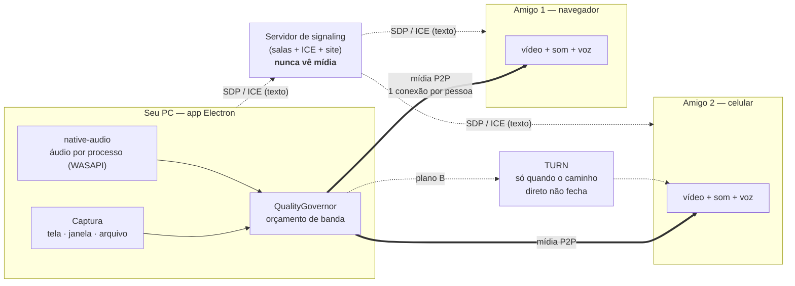

# Junto

Transmitir sua tela **com som**, ao vivo, para amigos ou colegas — sem delay
perceptível e sem instalar nada do lado de quem assiste.

- **Quem transmite** abre um app desktop (Electron).
- **Quem assiste** abre um link no navegador. Só isso.
- O vídeo vai **direto de um computador para o outro** (P2P/WebRTC). O servidor
  só apresenta os dois lados — nenhuma mídia passa por ele.

O que dá para transmitir:

| Fonte | Como funciona |
|---|---|
| Tela inteira ou monitor | Captura + áudio do sistema, com a opção de **silenciar um app** (ex.: o Discord) |
| **Uma janela, com som** | O caso que navegador nenhum consegue fazer |
| **Vídeo/filme do seu PC** | O arquivo toca aqui e vira stream; play/pause/seek valem para todos |
| **Modo Cinema** | Manda o arquivo **original** e cada um reproduz local, em sincronia — qualidade do arquivo, não do seu upload |

Mais **voz nos dois sentidos** (trilha separada do som do filme, com volume
próprio) e **chat de texto** pelo canal P2P.

## Como as peças se encaixam



O servidor é deliberadamente burro: ele apresenta os dois lados e sai da frente.
Toda a mídia — vídeo, som do sistema, voz e até o arquivo do filme — vai direto
de máquina para máquina.

## Resultados medidos

Nada aqui é estimativa; são leituras de sessões reais, com o método descrito em
[docs/VERIFICACAO.md](docs/VERIFICACAO.md).

| O que | Medido |
|---|---|
| Áudio ponta a ponta | tom de 440 Hz reproduzido chegou a **445 Hz**, estéreo, 48 kHz |
| Encoder de vídeo | `MediaFoundationVideoEncodeAccelerator (NVIDIA H.264 Encoder MFT)` — GPU, não CPU |
| Isolamento de áudio por janela | app que toca: RMS **0,248** · app silencioso: RMS **0,00001** |
| Modo Cinema | 12 MB transferidos **byte a byte idênticos**, buffer travado em 1,06 MB |
| Sincronia do Modo Cinema | desvio abaixo de **0,1 s** na maior parte do tempo |
| Aperto de banda (150 kbps) | áudio cai para **48 kbps** e o vídeo sobrevive em **360p** — antes, 88 kbps de som e 3 de imagem |
| Recuperação | 360p/48 kbps voltam sozinhos a **720p/192 kbps** quando a banda libera |

## Por que o host é um app nativo

Esse é o ponto que define o projeto. No navegador, `getDisplayMedia` só entrega
áudio quando você compartilha a **tela inteira** (e nem isso no Firefox/Safari).
Compartilhar **uma janela com som** — mostrar o jogo ou o filme para os amigos —
é impossível na web. No Electron, `audio: 'loopback'` captura a saída de áudio do
Windows sem driver virtual, independente da fonte de vídeo escolhida.

Ver [`apps/host/src/main/capture.ts`](apps/host/src/main/capture.ts).

## Rodando localmente

```bash
npm run setup
```

Depois, **três terminais**:

```bash
npm run dev:signaling
```

```bash
npm run dev:web
```

```bash
npm run dev:host
```

O app do host abre já conectado e com uma sala criada. Clique em **Escolher tela
ou janela**, marque *Incluir o som do computador*, e mande o link para quem vai
assistir (ou abra `http://localhost:5173` você mesmo, em outra janela).

> `npm run setup` roda o download do binário do Electron explicitamente porque o
> `postinstall` dele nem sempre dispara em monorepo com npm workspaces — o
> sintoma é `Error: Electron uninstall` ao rodar `dev:host`.

## Estrutura

| Pasta | O que é |
|---|---|
| `apps/host` | App Electron de quem transmite: captura, presets, HUD |
| `apps/web` | Viewer no navegador: entra por link, player, diagnóstico |
| `packages/rtc` | Núcleo WebRTC: sessões, ajuste de encoder, SDP, estatísticas |
| `packages/protocol` | Contrato de mensagens (zod), compartilhado por todos |
| `server/signaling` | Servidor de salas (Node + ws). Só texto, nunca mídia |
| `infra` | docker-compose com signaling + coturn + Caddy |

## As decisões que fazem diferença

Estão comentadas no código, mas em resumo:

- **Transceivers criados vazios** e preenchidos com `replaceTrack()`
  ([`host-session.ts`](packages/rtc/src/host-session.ts)) — trocar de fonte não
  renegocia SDP, então não há tela preta nem travada de 2 segundos.
- **Áudio do sistema sem processamento de voz**
  ([`sender-tuning.ts`](packages/rtc/src/sender-tuning.ts)) — cancelamento de
  eco, AGC e supressão de ruído ficam desligados nessa trilha. É o erro que
  quase todo app de watch party comete: com eles ligados, música e trilha de
  filme chegam abafadas e com volume oscilando.
- **Opus estéreo via SDP** ([`sdp.ts`](packages/rtc/src/sdp.ts)) — estéreo real
  não tem API; só entra como parâmetro `fmtp`. Precisa ser aplicado nos **dois**
  lados: no host para enviar, no viewer para autorizar receber.
- **Presets decidem o que sacrificar** ([`presets.ts`](packages/rtc/src/presets.ts))
  — sob pressão, `maintain-resolution` mantém texto nítido (trabalho),
  `maintain-framerate` mantém fluidez (jogo).
- **Buffer de reprodução zerado** no viewer (`jitterBufferTarget = 0`) — o padrão
  do navegador acumula centenas de ms para suavizar, ótimo para Netflix, péssimo
  para conversar sobre o que está na tela.
- **Host cai e volta com o mesmo link** — a sala sobrevive por 60s e o host
  retoma com um token secreto, em vez de gerar código novo no meio da sessão.
- **Voz numa trilha separada do som do sistema** — são três transceivers de
  ordem fixa (`MID_VIDEO`, `MID_SYSTEM_AUDIO`, `MID_VOICE` em
  [`protocol`](packages/protocol/src/index.ts)). Isso permite baixar o volume do
  filme e continuar ouvindo quem fala, e permite ligar cancelamento de eco só na
  voz — o oposto do que o som do sistema precisa.
- **Chat em estrela** — espectadores não se conectam entre si; o host carimba o
  autor e repassa. Um viewer não consegue se passar por outro.
- **Áudio isolado por processo** ([`packages/native-audio`](packages/native-audio))
  — compartilhando uma janela, sai **só** o som daquele aplicativo. O truque que
  faz a experiência funcionar: o id de fonte do Electron é `window:<HWND>:0`,
  então dá para chegar ao PID da janela escolhida e capturar o áudio dele — sem
  um segundo seletor onde daria para errar. Medido: com um tom tocando em outro
  app, o áudio de saída fica em RMS 0,00001 (silêncio) ao compartilhar uma janela
  diferente, e em 0,248 ao compartilhar a que toca.
- **Resolução segue a banda medida**, não o preset
  ([`bitrate-budget.ts`](packages/rtc/src/bitrate-budget.ts)) — e, crucialmente,
  só reduz quando o encoder **confirma** gargalo de banda. Bitrate baixo sozinho
  não é sinal: uma tela parada ou uma cena escura comprime para quase nada com a
  rede inteira livre.
- **Modo Cinema inverte a economia** ([`film-transfer.ts`](packages/rtc/src/film-transfer.ts))
  — em vez de recodificar 8 Mbps por duas horas, manda os bytes **uma vez** e
  depois só a posição do player. A correção de sincronia é assimétrica de
  propósito: desvio grande vira um pulo único, desvio pequeno vira ±3% de
  velocidade (imperceptível no áudio) até encostar. Corrigir tudo com seek
  deixaria a imagem engasgando o tempo todo.
- **Controle de fluxo na transferência** — sem ele, dava para enfileirar o filme
  inteiro no buffer do canal e estourar a memória antes de um byte sair. E os
  chunks são dobrados em `Blob` a cada 8 MB, o que mantém o heap pequeno mesmo
  num arquivo de vários GB.
- **Diagnóstico de rede antes de entrar** ([`network-check.ts`](packages/rtc/src/network-check.ts))
  — testa STUN e força um caminho `relay` para saber se o TURN realmente
  funciona. Sem isso, falhar em CGNAT é indistinguível de "o app está quebrado".
  Já se provou útil: apontado para um TURN público fora do ar, ele reportou
  "configurado, mas não respondeu" em vez de dar tudo como certo.
- **Perfil de H.264 decide se a GPU entra** ([`sender-tuning.ts`](packages/rtc/src/sender-tuning.ts))
  — o Chromium roteia o Constrained Baseline (`42e01f`) para o encoder de
  software. Preferir High (`640020`)/Main (`4d001f`) é o que leva ao NVENC.
  Medido: com `42e01f` o encoder era `OpenH264`; com a ordem corrigida virou
  `MediaFoundationVideoEncodeAccelerator (NVIDIA H.264 Encoder MFT)`. Há um
  [teste](packages/rtc/test/codec.test.mjs) travando essa ordem, porque nada no
  nome do perfil denuncia a diferença.
- **Áudio e vídeo dividem UM orçamento**
  ([`bitrate-budget.ts`](packages/rtc/src/bitrate-budget.ts)) — e essa foi a
  correção mais cara de descobrir. O áudio era fixo em 256 kbps e nunca adaptava;
  como o WebRTC atende o áudio **antes** do vídeo, num link de ~100 kbps ele se
  servia primeiro e sobravam 3 kbps para a imagem. Os dois números do painel
  batiam e ninguém tinha percebido: o host mostrava 3 kbps (só vídeo) e quem
  assistia relatava 91 kbps (vídeo + áudio). Hoje o áudio desce em degraus
  (256 → 128 → 96 → 64 → 48) e só então a resolução é escolhida com o que sobra.
- **Cortar o áudio não espera histerese** — trocar de resolução tem carência de
  5 a 15 s para a imagem não ficar piscando, mas apertar o áudio é imediato:
  enquanto ele estiver grande demais, o vídeo não tem de onde sair.
- **Perda de pacotes medida por trilha** ([`stats.ts`](packages/rtc/src/stats.ts))
  — antes o numerador somava a perda das três trilhas e o denominador só tinha os
  pacotes de vídeo. Numa sessão real isso virou "perda de 28,6%" com RTT de 25 ms,
  e mandou a investigação inteira para o lado errado. Agora cada
  `remote-inbound-rtp` é casado com o `outbound-rtp` de mesmo SSRC.
- **Ninguém fica em "Conectando…" para sempre**
  ([`viewer-session.ts`](packages/rtc/src/viewer-session.ts)) — passados 12 s, o
  viewer refaz a conexão **forçando o caminho por TURN** e, se ainda assim não
  fechar, mostra o que encontrou (tipos de candidato, se havia TURN) em vez de
  continuar prometendo. O navegador sozinho leva minutos para admitir `failed`.
- **O viewer pede a oferta nova, o host a produz** — quem responde não pode
  reiniciar o ICE; só quem oferta. Sem a mensagem `renegotiate` no
  [protocolo](packages/protocol/src/index.ts), a única saída de uma conexão presa
  seria recarregar a página.
- **Vídeo começa mudo, de propósito**
  ([`apps/web/src/App.tsx`](apps/web/src/App.tsx)) — o Safari do iPhone recusa
  autoplay com som, e a recusa **não parece um erro**: fica uma tela preta,
  idêntica a "não conectou". Mudo, o autoplay é sempre permitido; a imagem
  aparece na hora e sobra um toque para liberar o som.
- **"Pode pegar da minha internet" é um botão de verdade**
  ([`sdp.ts`](packages/rtc/src/sdp.ts)) — `x-google-start-bitrate` mata a rampa
  de 30 s com que toda sessão WebRTC arranca, e `x-google-min-bitrate` impede o
  encoder de ser estrangulado por uma estimativa pessimista. Com uma trava: se a
  perda de vídeo passar de 10% por 10 s, o piso é desligado sozinho e o painel
  diz que foi. Forçar banda que não existe não entrega imagem — entrega
  congelamento. E o piso **volta** sozinho depois de um minuto de rede saudável:
  um botão que só sabe se desligar é um botão quebrado pela metade.
- **Estatísticas dos dois lados** — o viewer reporta pelo canal de controle o que
  está realmente recebendo, então o HUD do host mostra o gargalo do *outro* lado,
  não só o próprio.

## Testes

```bash
npm test
```

54 testes sobre o que não dá para ver olhando: a sincronização do Modo Cinema
converge em vez de oscilar, o arquivo é remontado byte a byte, o orçamento de
banda corta o áudio antes de destruir a imagem, a perda é atribuída à trilha
certa, e a ordem dos perfis de H.264 continua levando ao encoder da GPU.

```bash
npm run test:signaling
```

Com o servidor rodando: 26 verificações — criar sala, entrar, relay de SDP/ICE,
pedido de renegociação, senha errada, token inválido, remover/bloquear e
queda/retomada do host.

Para o caminho de mídia, a verificação é manual e está descrita em
[docs/VERIFICACAO.md](docs/VERIFICACAO.md).

## Transmitir para outras pessoas

Para os amigos entrarem, só o **servidor** precisa estar acessível pela internet.
O vídeo continua indo direto do seu PC para o deles — o servidor nunca vê mídia,
então ele não vira gargalo nem custo de banda.

O servidor serve o site **e** o WebSocket na mesma porta, então publicar é
expor uma porta só.

### Caminho rápido: túnel (hoje, de graça, sem domínio)

```bash
npm run serve
```

Em outro terminal, com [cloudflared](https://developers.cloudflare.com/cloudflare-one/connections/connect-networks/downloads/):

```bash
cloudflared tunnel --url http://localhost:8787
```

Ele devolve uma URL `https://algo.trycloudflare.com`. Aponte o app do host para
ela e reinicie:

```bash
JUNTO_SIGNALING_URL=wss://algo.trycloudflare.com/ws JUNTO_WEB_URL=https://algo.trycloudflare.com npm run dev:host
```

No PowerShell a mesma coisa se escreve assim:

```powershell
$env:JUNTO_SIGNALING_URL="wss://algo.trycloudflare.com/ws"; $env:JUNTO_WEB_URL="https://algo.trycloudflare.com"; npm run dev:host
```

Agora o link que aparece no app já é o público — é só mandar. O HTTPS vem do
túnel, o que importa porque **navegador só libera WebRTC em contexto seguro**.

### Caminho permanente: VPS com domínio

```bash
cp .env.example .env      # ajuste JUNTO_DOMAIN e TURN_SECRET
npm run build -w @junto/web
cd infra && docker compose --env-file ../.env up -d
```

O Caddy resolve o certificado sozinho a partir de `JUNTO_DOMAIN`, e o coturn sobe
junto. Aponte o app do host para `wss://seu-dominio/ws`.

### TURN: o que separa "funciona com meus amigos" de "funciona com qualquer um"

Sem TURN, quem estiver em **4G ou em provedor com CGNAT** simplesmente não
conecta. Não é hipótese: um amigo tentou entrar pelo iPhone e ficou em
"Conectando…" indefinidamente. O túnel resolve o acesso ao **servidor** e não
resolve isso — o TURN é sobre o caminho da **mídia**.

O caminho mais curto é o TURN gerenciado da Cloudflare (1000 GB/mês grátis, nada
para manter). No painel: **Realtime → TURN → Create**, e depois:

```bash
CF_TURN_KEY_ID=...  CF_TURN_API_TOKEN=...  npm run serve
```

O servidor gera credenciais de curta duração sozinho e as renova antes de
expirarem — o token nunca sai da sua máquina, e um link vazado não vira TURN
gratuito para terceiros. Ver [`ice.ts`](server/signaling/src/ice.ts).

A alternativa é o coturn do `docker-compose` numa VPS (`TURN_URLS` +
`TURN_SECRET`), lido automaticamente quando as variáveis da Cloudflare não
existem.

Para conferir sem adivinhação:

```bash
curl https://seu-servidor/ice
```

Se a resposta só tiver `stun:`, o TURN não está configurado. O botão **Testar
minha conexão** na tela de entrada faz o mesmo teste do lado de quem assiste —
inclusive forçando um caminho `relay`, que é a única forma de saber se o TURN
**responde** e não só se está escrito na configuração.

## O que ainda não existe

- **MKV não funciona — e falha de um jeito traiçoeiro.** Medido com um arquivo
  real do conjunto de testes do Matroska: o Chromium **abre** o container, toca o
  **áudio** e avança a posição normalmente, mas a trilha de vídeo fica `0x0`.
  Nenhum erro é disparado. Sem checagem, o app transmitiria som com tela preta.
  Por isso [`filePlayer.ts`](apps/host/src/renderer/src/filePlayer.ts) valida
  `videoWidth > 0` depois de carregar e recusa o arquivo com a linha de conversão
  pronta (`ffmpeg -c copy`, que remuxa sem recodificar). MP4/WebM/MOV funcionam.
- **Modo Cinema baixa o arquivo inteiro antes de começar.** Streaming
  progressivo exigiria MSE com fMP4 (a maioria dos MP4 não é fragmentado) ou
  remux em WASM — o caminho atual funciona com qualquer formato que o navegador
  toque, ao custo da espera.
- **Silenciar mais de um app por vez.** Em tela cheia dá para excluir o áudio de
  **um** aplicativo (o Discord, tipicamente) — a API do Windows recebe um
  processo por captura. Silenciar vários exigiria misturar várias capturas.
- **O TURN da Cloudflare está implementado mas ainda não foi exercitado contra
  uma chave real** — o caminho de código roda e cai para STUN sem quebrar quando
  as variáveis não existem, mas a primeira sessão de verdade por relay ainda está
  para acontecer. O botão *Testar minha conexão* diz na hora se ele está de pé.
- **Um SFU**, para quando forem muitas pessoas. Hoje cada espectador é uma
  conexão e uma cópia do upload: cinco pessoas em 4 Mbps são 20 Mbps de subida.
  A interface [`Broadcaster`](packages/rtc/src/transport.ts) existe para isso.
  Para 2–5 amigos, o P2P rende mais por muito menos.

**Serviços com DRM** (Netflix, Disney+, Prime Video, HBO) aparecem como tela
preta em qualquer captura. Isso é proteção do conteúdo, não bug, e está fora do
escopo.
